# Short-Info-NeuromProject
The short introduction of the neurome project

### 
The Short Introduction of [The Neurome Project](https://sites.google.com/view/the-neurome-project/home)
 ###

Project leader: [Dr. Larry W. Swanson](http://larrywswanson.com/?page_id=13)

 
Adapted from [the-neurome-project](https://sites.google.com/view/the-neurome-project/home)

#### Toward a Pan-Mammalian Neurome ####

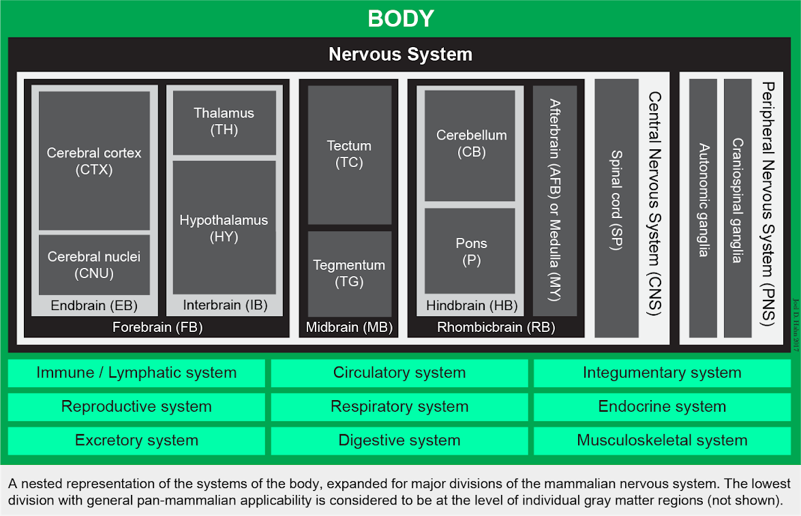

Adapted from [the-neurome-project](https://sites.google.com/view/the-neurome-project/home)

The neurome project aim can be divided two parts:

- ##### 'proximal' goal #####
Complete construction and network analysis of macroconnection subconnectomes for the mammalian forebrain. 

- ##### 'distal' goal #####
Achieve this for all major brain parts, and eventually the entire nervous system, leading to integration with other brain data (such as gene-expression) at multiple levels of spatial resolution.

#### Chapter 1  Connection ####

In the connection section, the project main collects three part of connection, they are **Cerebral cortex**, **Cerebral nuclei**, **Hypothalamus**. Here mammalian animal model is Rat.

+ Cerebral cortex: provides a searchable list of region-to-region (macroscale) collated published connection reports (macroconnections) for the cerebral cortex of the rat. Currently, these data include reports of macroconnections within the cerebral cortex, and between the cerebral cortex and cerebral nuclei (basal ganglia).

+ Cerebral nuclei: provides a searchable list of region-to-region (macroscale) collated published connection reports (macroconnections) for the cerebral nuclei (basal ganglia) of the rat. Currently, these data include reports of macroconnections within the cerebral nuclei, and between the cerebral nuclei and cerebral cortex.

+ Hypothalamus: provides a searchable list of region-to-region (macroscale) collated published connection reports (macroconnections) for the hypothalamus of the rat. Currently, these data include reports of macroconnections within the hypothalamus (intrahypothalamic macroconnections).

Region nomenclature follows an open access atlas for the rat brain ([Brain Maps 4.0. Swanson, L. W. 2018](https://onlinelibrary.wiley.com/doi/full/10.1002/cne.24381)). Part of figures see Appendix. 

#### Chapter 2 Rat neurome project ####

##### Connectome #####

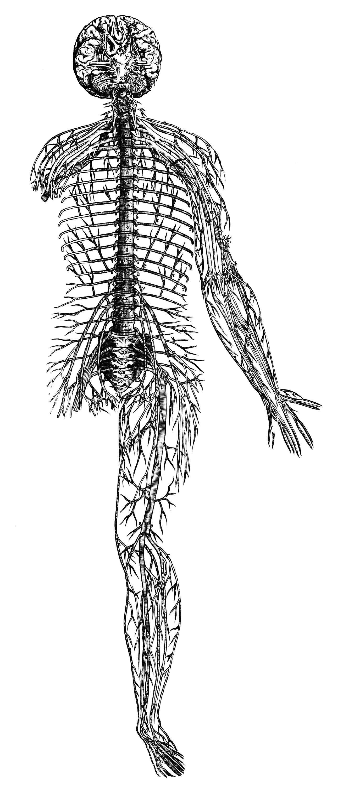

The human nervous system (Vesalius, 1543)

The term *“connectome”* was introduced by Olaf Sporns, Giulio Tononi, and Rolf Kötter in a 2005 paper, [The human connectome: a structural description of the human brain](http://www.ncbi.nlm.nih.gov/pubmed/?term=Sporns+2005+connectome), where they stated that “The connection matrix of the human brain (the human ‘connectome’) represents an indispensable foundation for basic and applied neurobiological research.”

A complete connectome would include not just the brain, but the nervous system as a whole, along with the other systems of the body (muscular, endocrine, digestive, and so on) related to the nervous system (that is, providing inputs and receiving outputs)–a connection matrix that has been called a neurome (Bota et al., 2015, PNAS). Here is the general form of such a complete connectome, which, of course, is bilateral, representing the right and left halves of the body:

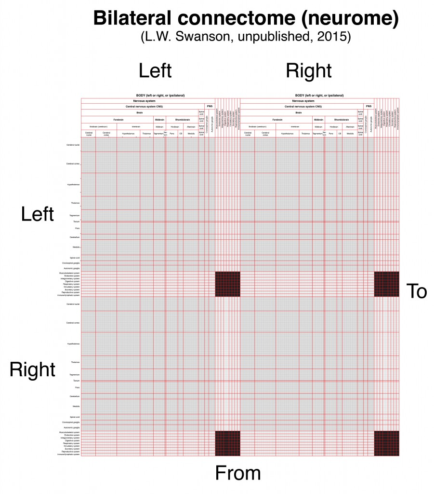

A complete mammalian connectome, or neurome (L.W. Swanson, 2015, unpublished).

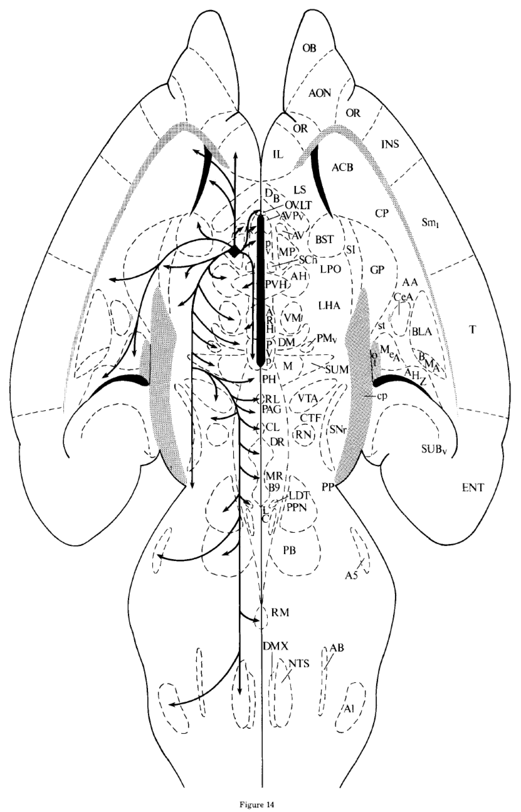

Flatmap showing output connections (pathways and terminal fields) of the rat medial preoptic nucleus (Simerly & Swanson, 1988).

 
A series of flatmaps from the neural plate stage to the adult central nervous system.

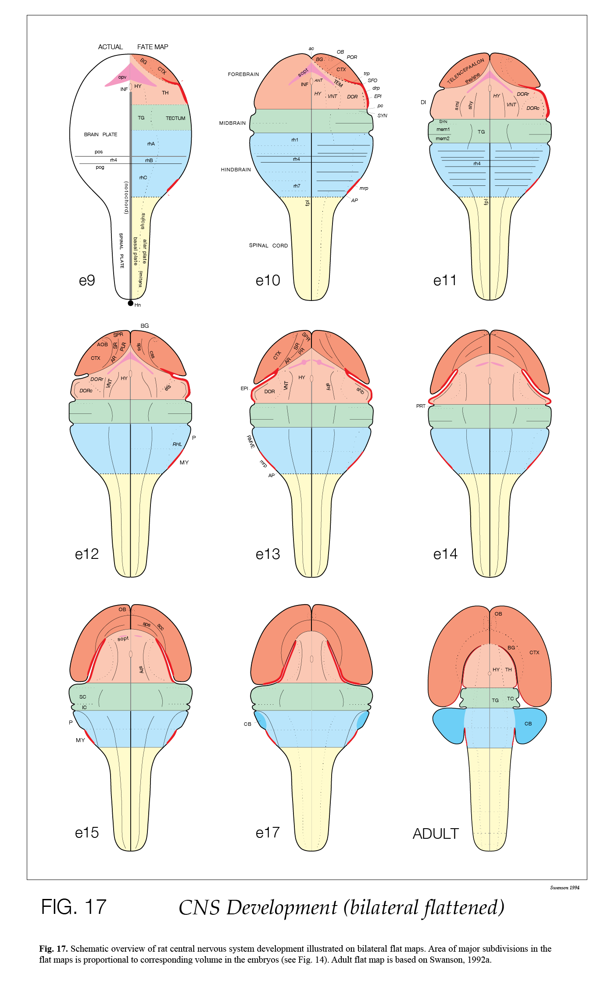
Adapted from Alvarez-Bolado & Swanson (1996).

#### Chapter 3 Flatmaps ####

Comparison of rat and human central nervous system flatmaps.

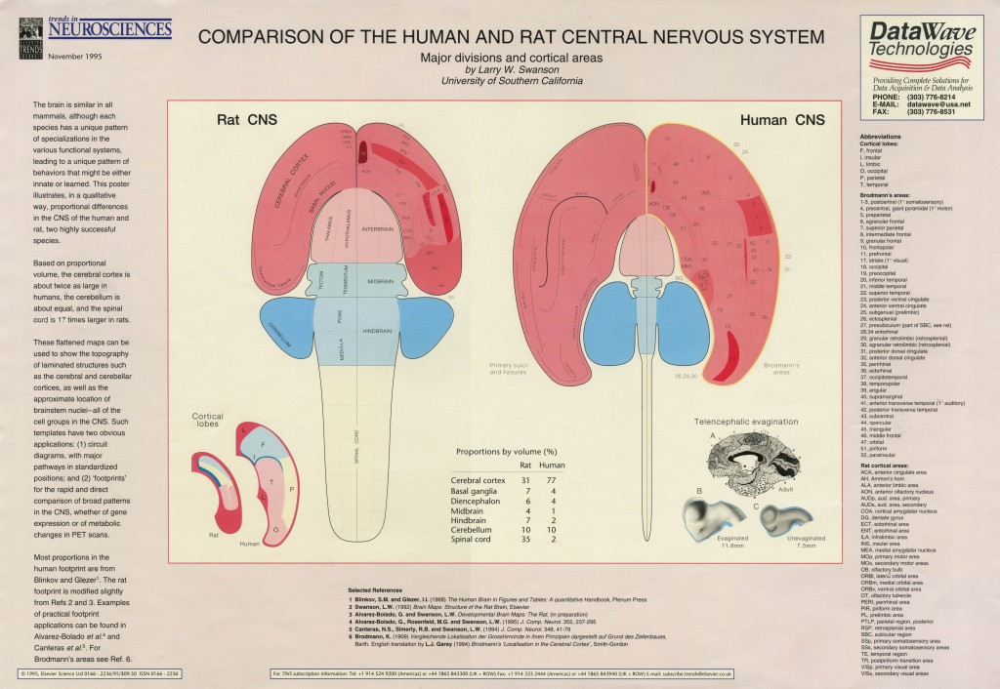

Poster by L.W. Swanson published in Trends in Neurosciences (November, 1995).

##### MAPPING CONNECTIONS ON STANDARD TEMPLATES #####

Since 1992, virtually all of the experimental pathway tracing analyses carried out by the Swanson group in rat have been mapped onto standard atlas and flatmap templates from the 3 editions of Brain maps: structure of the rat brain (Swanson, 1992, 1998, 2004). This approach greatly simplifies qualitative comparisons of connection patterns for different parts of the nervous system. The first example was for the connections of the posterior nucleus of the amygdala, and adjacent parts of the cortical nucleus of the amygdala (Canteras et al., 1992).

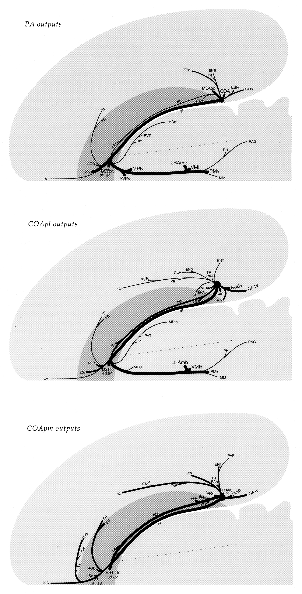
Outputs on a flatmap of rat amygdalar regions (Canteras et al., 1992).

##### A FLATMAP TEMPLATE FOR THE COMPLETE RAT CONNECTOME #####

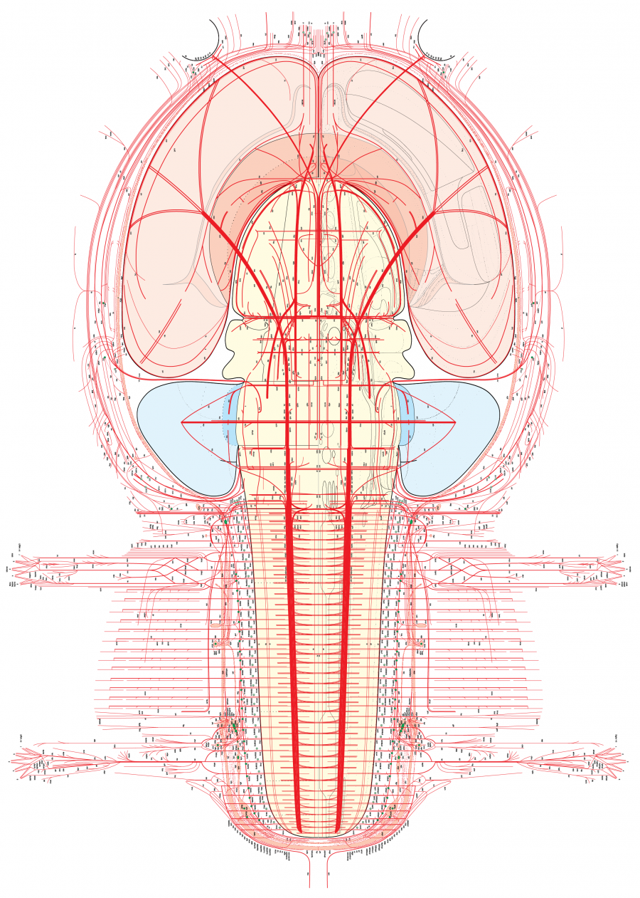
Rat nervous system flatmap (Swanson, L.W., version 4.0 beta3, 2015).

#### Online resources ####
* Text for the first three print editions of the atlas (Swanson, [1992](https://onlinelibrary.wiley.com/doi/full/10.1002/cne.24381#cne24381-bib-0020), [1993](https://onlinelibrary.wiley.com/doi/full/10.1002/cne.24381#cne24381-bib-0021), [1998](https://onlinelibrary.wiley.com/doi/full/10.1002/cne.24381#cne24381-bib-0023), [2004](https://onlinelibrary.wiley.com/doi/full/10.1002/cne.24381#cne24381-bib-0027)), and accompanying files for illustrations, are freely available under a Creative Commons BY‐NC 4.0 license at [larrywswanson.com](http://larrywswanson.com/).

* List of Larry’s papers on the [behavioral neuroscience](http://larrywswanson.com/wp-content/uploads/2015/03/LWS-behavior-papers.pdf) of motivation and emotion.

* List of Larry’s publications on the nervous system as a [network](http://larrywswanson.com/wp-content/uploads/2015/03/LWS-network-pubs.pdf) like the Internet rather than a hierarchy like the military.

* List of Larry’s papers on the structural neuroscience of [connections](http://larrywswanson.com/wp-content/uploads/2015/03/LWS-connections-papers.pdf) forming the circuitry underlying motivation and emotion.

* List of Larry’s papers related to neuroanatomical [methodology](http://larrywswanson.com/wp-content/uploads/2015/03/LWS-methods-papers.pdf).

* List of Larry’s papers on [development](http://larrywswanson.com/wp-content/uploads/2015/03/LWS-development-papers.pdf) of brain structural organization. 

* BRAIN MAPS 4.0 (2018): [Online open access](http://onlinelibrary.wiley.com/doi/10.1002/cne.24381/abstract;jsessionid=5306D803FDF5E010B1BCBB94AE1D2101.f03t02?systemMessage=Please+be+advised+that+we+experienced+an+unexpected+issue+that+occurred+on+Saturday+and+Sunday+January+20th+and+21st+that+caused+the+site+to+be+down+for+an+extended+period+of+time+and+affected+the+ability+of+users+to+access+content+on+Wiley+Online+Library.+This+issue+has+now+been+fully+resolved.++We+apologize+for+any+inconvenience+this+may+have+caused+and+are+working+to+ensure+that+we+can+alert+you+immediately+of+any+unplanned+periods+of+downtime+or+disruption+in+the+future.).

* DEVELOPMENTAL BRAIN MAPS (1996): [Atlas Levels for download](http://larrywswanson.com/?page_id=164)

* [The Mouse Connectome Project](http://www.mouseconnectome.org/):  
An online resource for extensive information about the mouse connectome project led by Hong-Wei Dong at the University of Southern California.

* [Golgi](https://www.frontiersin.org/articles/10.3389/fninf.2015.00026/full):  
A prototype “Google Maps for the Brain” website was developed by Ramsay Brown.

* [NeuARt II](https://www.ncbi.nlm.nih.gov/pubmed/17166289):  
This is a website for layering neuroanatomical or functional data over standard atlas levels of brain atlases. Its development began in the late 1990s and is currently on hold, although still under the careful watch of Gully Burns.

#### Appendix ####
1.
<blockquote>
Header Image: (left line diagram) A theoretical prototypical circuit for the control of behavior involving visual sensory input, central integration, and motor output (adapted from L'Homme. René Descartes. 1664); (right line diagram) A later empirical theoretical schema for control of behavior based on neuronal architecture and connections (adapted from Les nouvelles idées sur la structure du système nerveux chez l'homme et chez les vertébrés. Santiago Ramón y Cajal. 1894). The line diagrams are overlaid on an image acquired from the Hubble space telescope in 2016. Light from the stars of several galaxies is visible in a field parallel to galaxy cluster Abell S1063, located some 4 billion light years distant to planet Earth (coincidentally a similar time period from the earliest appearance of life on Earth).
</blockquote>

2.  
[Brain maps 4.0—Structure of the rat brain: An open access atlas with global nervous system nomenclature ontology and flatmaps](https://onlinelibrary.wiley.com/doi/full/10.1002/cne.24381)

<blockquote>
<b>Abstract</b>   

The fourth edition (following editions in 1992, 1998, 2004) of Brain maps: structure of the rat brain is presented here as an open access internet resource for the neuroscience community. One new feature is a set of 10 hierarchical nomenclature tables that define and describe all parts of the rat nervous system within the framework of a strictly topographic system devised previously for the human nervous system. These tables constitute a global ontology for knowledge management systems dealing with neural circuitry. A second new feature is an aligned atlas of bilateral flatmaps illustrating rat nervous system development from the neural plate stage to the adult stage, where most gray matter regions, white matter tracts, ganglia, and nerves listed in the nomenclature tables are illustrated schematically. These flatmaps are convenient for future development of online applications analogous to “Google Maps” for systems neuroscience. The third new feature is a completely revised Atlas of the rat brain in spatially aligned transverse sections that can serve as a framework for 3‐D modeling. Atlas parcellation is little changed from the preceding edition, but the nomenclature for rat is now aligned with an emerging panmammalian neuroanatomical nomenclature. All figures are presented in Adobe Illustrator vector graphics format that can be manipulated, modified, and resized as desired, and freely used with a Creative Commons license.
</blockquote>

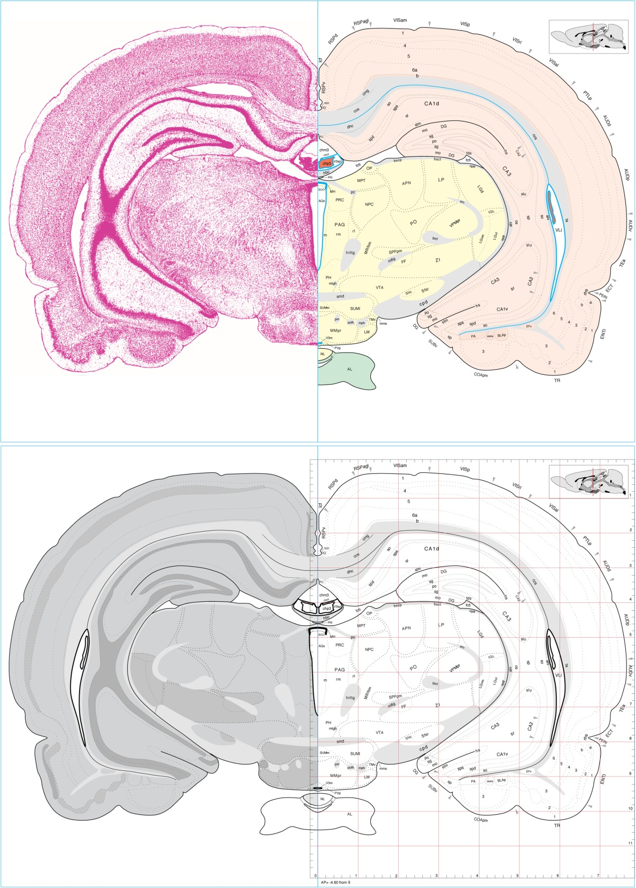
Atlas of the adult rat brain. Adapted from Brain Maps 4.0. Swanson, L. W. 2018. 

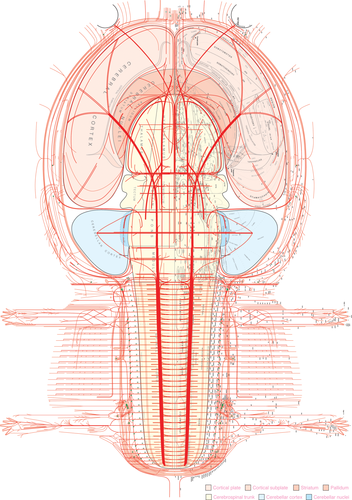

Atlas of flatmaps. Adapted from Brain Maps 4.0. Swanson, L. W. 2018. 

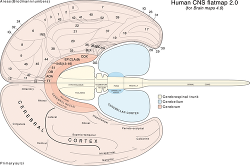

Human CNS flatmaps 2.0. Adapted from Brain Maps 4.0. Swanson, L. W. 2018.  

3.  

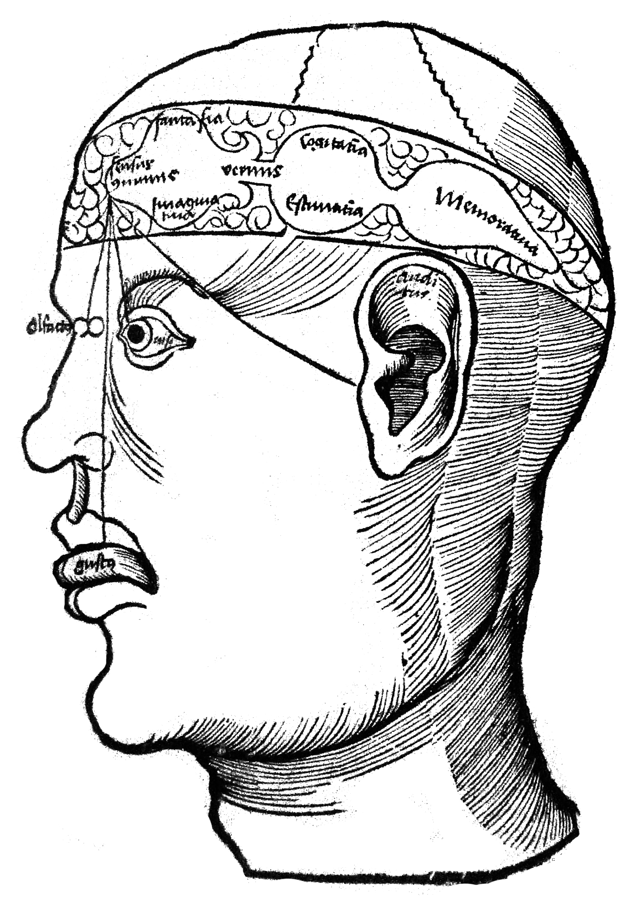
The 3-Cell Theory of brain function; from Gregor Reisch, Margarita philosophica (1504), courtesy of UCLA Darling Biomedical Library.

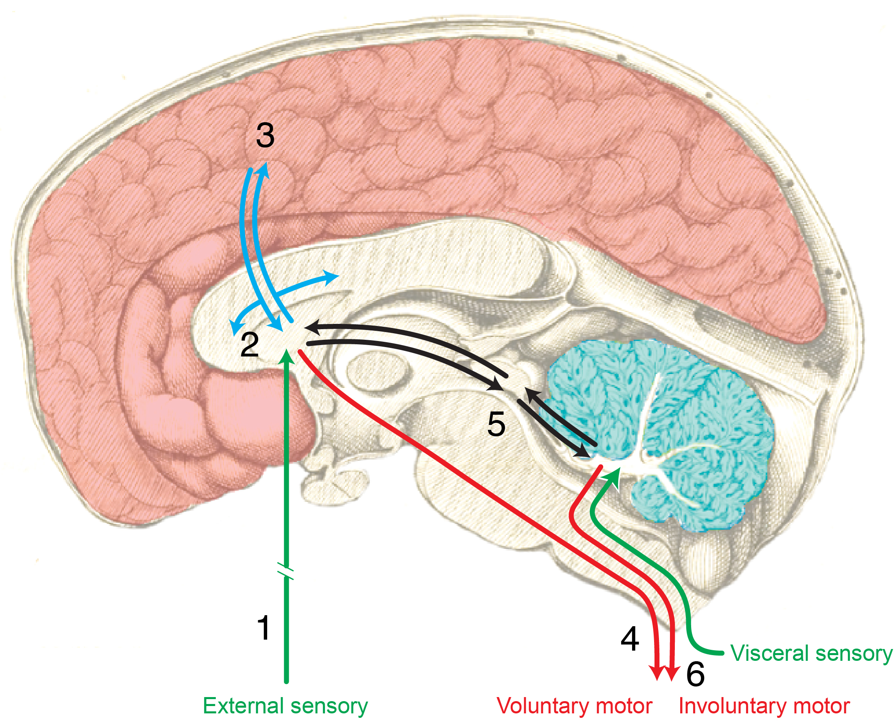
Thomas Willis’s 1664 scheme for the overall organization of nervous system structure-function circuitry (L.W. Swanson, unpublished drawing, 2009).

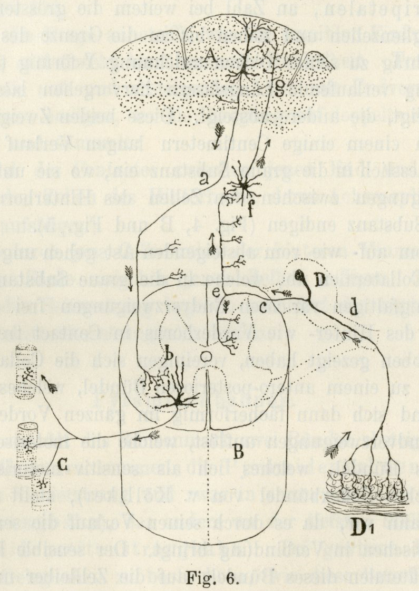
The first basic plan for nervous system organization based on the cell theory; from Cajal, S.R.y (1893) Arch. Anat. Physiol., Anat. Abth., parts V & VI, pp. 310-428.

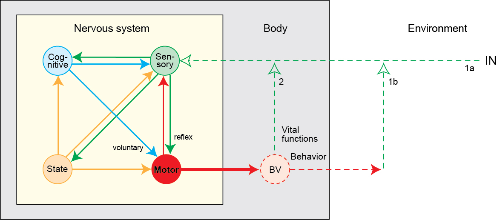
Four systems network model of nervous system organization (Swanson, L.W., 2012, Brain Architecture, 2nd edition). BV, behavior (skeletomotor) and vital (autonomic and neuroendocrine) functions.

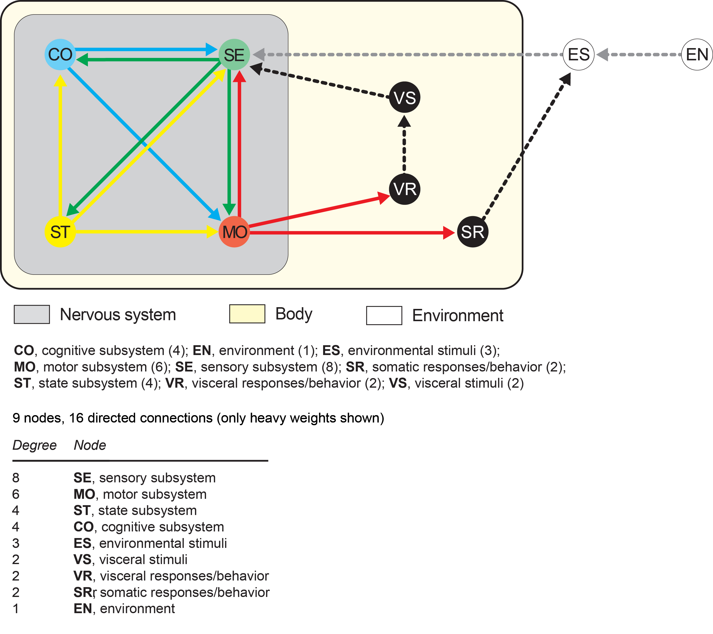
Graph of the 4-systems network model of the nervous system (L.W. Swanson, unpublished, 2015).

4.Neuroscience History  
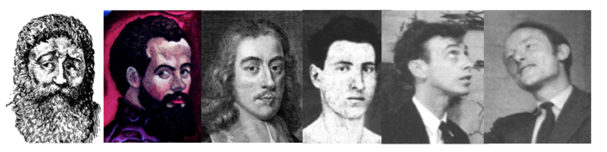
Galen, Vesalius, Willis, Cajal, Watson, Crick

*[History of Neuroscience](http://larrywswanson.com/wp-content/uploads/2015/03/SfN-History-of-NS-Chicago-2009.ppt)*, Dr. Larry W. Swanson's Lecture at the *39th annual meeting of the Society for Neuroscience in Chicago (October 20, 2009)*.
#### References ####

1. Monro, A. secundus (1783). Observations on the Structure and Functions of the Nervous System: Illustrated with Tables (Creech & Johnson, Edinburgh).
2. Sporns, O., Tononi, G., Kotter, R. (2005). The human connectome: A structural description of the human brain. PLoS Comput Biol. 1, e42. doi: 10.1371/journal.pcbi.0010042
3. Bota, M., Sporns, O., Swanson, L.W. (2015). Architecture of the cerebral cortical association connectome underlying cognition. Proc Natl Acad Sci U S A. 112, E2093-2101. doi: 10.1073/pnas.1504394112
4. Swanson, L.W. & Lichtman, J.W. (2016). From Cajal to Connectome and Beyond. Annu Rev Neurosci. 39, 197-216. doi: 10.1146/annurev-neuro-071714-033954
5. Swanson, L.W. & Bota, M. (2010). Foundational model of structural connectivity in the nervous system with a schema for wiring diagrams, connectome, and basic plan architecture. Proc Natl Acad Sci U S A. 107, 20610-20617. doi: 10.1073/pnas.1015128107
6. Swanson, L.W. (2018). Brain Maps 4.0—Structure of the rat brain: An open access atlas with global nervous system nomenclature ontology and flatmaps. Swanson, L.W. (2018). J Comp Neurol. 526, 935-943. doi: 10.1002/cne.24381
7. Hahn, J.D. & Swanson, L.W. (2015). Distinct patterns of neural inputs and outputs of the dorsal and ventral zones of the juxtaventromedial region of the lateral hypothalamic area in the male rat. Front Syst Neurosci. 9. doi: 10.3389/fnsys.2015.00066
8. Jeub, L.G.S., Sporns, O., Fortunato, S. (2018). Multiresolution consensus clustering in networks. Sci Rep. 8:3259. doi: 10.1038/s41598-018-21352-7
9. Swanson, L.W., Sporns, O., Hahn, J.D. (2016). Network architecture of the cerebral nuclei (basal ganglia) association and commissural connectome. Proc Natl Acad Sci U S A. 113, E5972-E5981. doi: 10.1073/pnas.1613184113
10. Swanson, L.W., Hahn, J.D., Sporns, O. (2017). Organizing principles for the cerebral cortex network of commissural and association connections. Proc Natl Acad Sci U S A. 114, E9692-E9701. doi: 10.1073/pnas.1712928114
11. Swanson, L.W., Hahn, J.D., Jeub, L.G.S., Fortunato, S., Sporns, O. (2018). Subsystem organization of axonal connections within and between the right and left cerebral cortex and cerebral nuclei (endbrain). Proc Natl Acad Sci U S A. 115, E6910-E6919. doi: 10.1073/pnas.1807255115
12. Hahn, J.D., Sporns, O., Watts, A.G., Swanson, L.W. (2019). Macroscale intrinsic network architecture of the hypothalamus. Proc Natl Acad Sci U S A. (in press)
